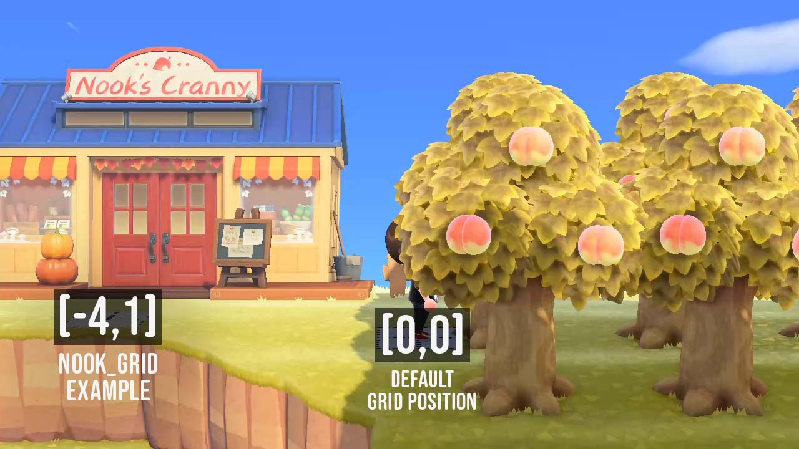
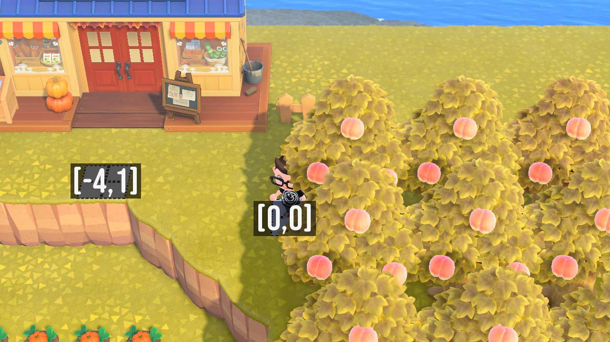
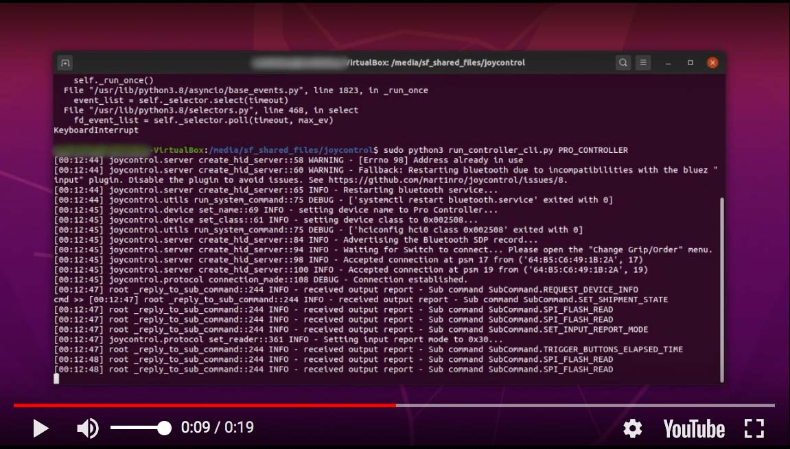
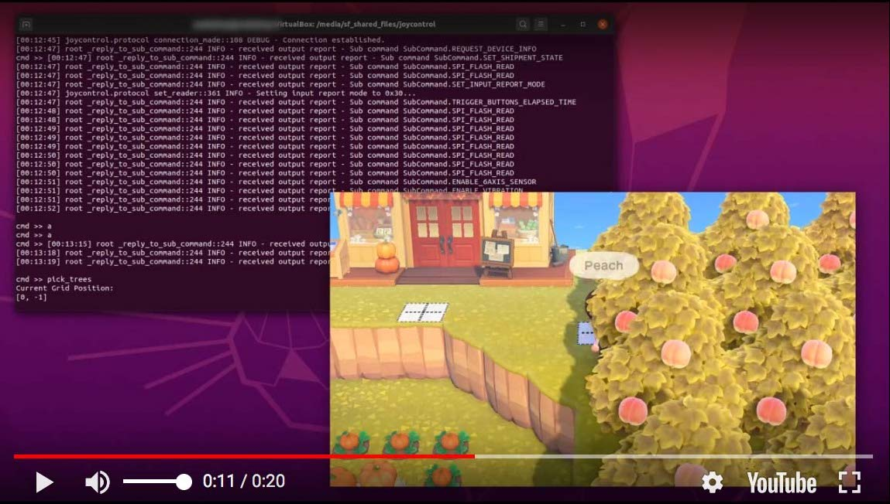
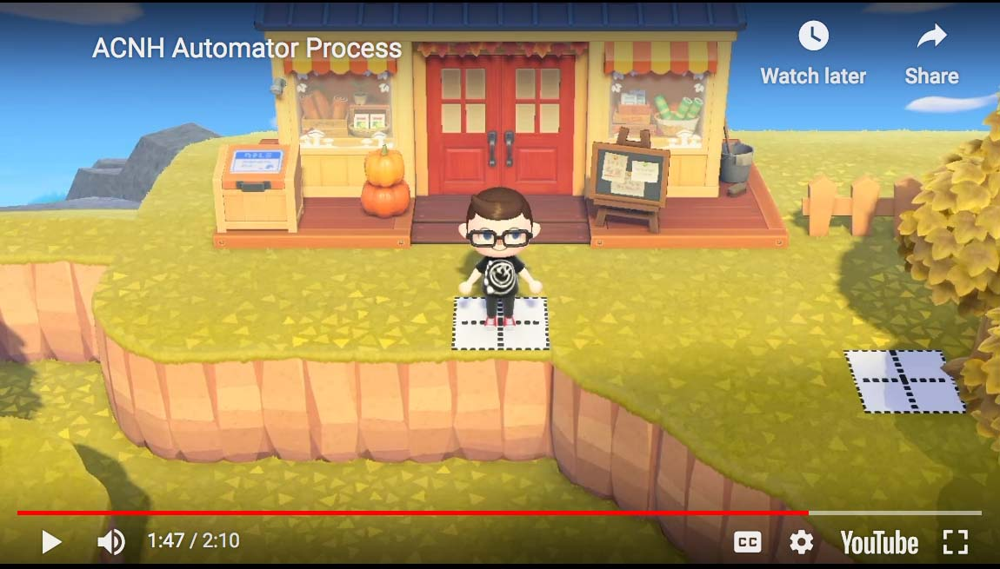

# ACNH Automator
## *Tom Nook will hate you because of this one weird trick!*

ACNH Automator utilizes the [joycontrol](https://github.com/mart1nro/joycontrol) library to automate repetitive tasks in Animal Crossing New Horizons.

Joycontrol (created by [mart1nro](https://github.com/mart1nro/)) is a python based toolset that emulates a Nintendo Switch controller over Bluetooth, and I've included the full joycontrol README below.

As of now, ACNH Automator has one available automation task called ***pick_trees*** which allows you to automatically pick fruit from trees and sell the fruit at Nook’s Cranny. I hope to design more features in the future to help with things like repetitive crafting tasks.

 Once you get joycontrol working, you can run ***pick_trees*** as a joycontrol command.

# Instructions

Before running ACNH Automator, you will need to input some information about your tree grid and where Nook’s Cranny is located in your town. In a future release this information will be entered into a command line prompt when running joycontrol, but for the current release you must edit the **run_controller_cli.py** file.

On line 63 of **run_controller_cli.py** you will find **tree_pick_data** being defined as an instance of the **TreePickLogic** class. It is populated with sample data that you will have to change. There are also secondary defaults that are defined, which can be updated as necessary. I've included an explanation of each item you will have change below, as well as some reference images to clarify how the grid system is set up:

## Default Instance Variables To Edit:

***tree_grid_x*** - amount of trees x direction

***tree_grid_y*** - amount of trees in y direction

***nook_grid*** - position in [x,y] to travel to first before entering Nook's.

**nook_grid** needs to be exactly 2 spaces below where the actual building is. It is designed this way to avoid running into building by accident.

***inv_free_space*** - free space in your inventory before running 'pick trees'

***inventory_total_space*** - total inventory space, defaults to fully upgraded amount of 40

## Secondary Defaults To Edit If Necessary:

***move_speed*** - amount of time to *'await asyncio.sleep'* in order to move one grid space

***move_speed_default = move_speed*** - sets default move speed to allow for slightly changing move_speed later when travelling long distances

***trees_picked_total*** - total number of trees picked

***trees_picked_current_row*** - number of trees picked so far in the current row

***tree_rows_picked*** - total number of tree rows that have been picked

***current_grid_position*** - current grid position in [x,y], first tree picking position is at [0,0] first tree itself is at [1,0]

***current_direction*** - current movement direction, set to 'right' or 'left' depending on your tree grid setup

***fruit_in_pockets*** - number of fruit in pockets, should get set back to 0 after selling

***nook_load_time*** - amount of time to wait for load screen when entering and exiting Nook's

***safety_space*** - #leave safety spaces for picking up random items like tree branches, acorns, weeds, etc.

***bells_in_wallet*** - current amount of bells in wallet, defaults to 99000 to assume a full wallet

***bells_space*** = total amount of bell bags that will be generated when tree picking is done

#

## Grid Information and Examples

**ACNH Automator v1.0** assumes that your trees are spaced exactly one grid space apart from each other in the *x* and *y* direction. Options for updating this will be available in a future release. Grid space is measured in **[x,y]** and assumes that **[0,0]** is the space directly to the left of the top-left tree. The nook_grid value should be exactly 2 spaces below Nook’s Cranny to avoid running into the building by accident.




#

## Other recommendations

- You MUST make sure that your inventory selector (the hand icon when you’re in your inventory) is located on the first inventory space, or the selling process will not work properly.

- I also recommend clearing out your inventory of anything you don’t want to accidentally sell until you are very comfortable with this toolset.
It’s important to have Nook’s Cranny located as close as possible to your tree grid in order to make traveling to sell your fruit easier.

- I recommend separating your tree grid from the rest of the town to avoid the possibility of villagers getting in your way, I solved this by building on a cliff that is inaccessible to villagers.

- Try to only have one space available on either side of your tree grid, this will help your character “get back on track” if the automation goes awry.

Once you’ve entered your town’s data into run_controller_cli.py you can navigate your character to grid space [0,0] and move on to the next step.

#

## Emulating the controller and running “pick_trees”

ACNH Automator relies on joycontrol to run, so you’ll need to first navigate to the Change Grip/Order menu on your Nintendo Switch, run joycontrol to begin emulating a controller, and then navigate back to Animal Crossing before running the pick_trees command.

The process of starting up joycontrol is explained below, and I've included a video to show what the process will look like:

[](https://youtu.be/abelJBKkvMg "Joycontrol Example 1 - Click to Watch")

Once joycontrol is up and running and your character is at [0,0] facing the first tree, you can simply run the following command:

```
pick_trees
```

[](https://youtu.be/MC1LuzBEf-4 "Joycontrol Example 2 - Click to Watch")

#

### Based on the information you entered about your town, your character will now:

- Navigate through the grid, harvesting fruit from each tree in the x direction until it reaches the last tree in the row.

- Travel down two spaces in the y direction to proceed to the next row, and change direction accordingly.

- Stop picking trees when a threshold is met for the amount of fruit that can be safely stored in your inventory.

- Travel to Nook’s Cranny to sell all of the fruit, and travel back to the next tree that needs to be picked.

- Repeat this process until all fruit is harvested and sold.

#
Here is an example of what this process looks like in action:

[](https://youtu.be/vURoaECIB4M "ACNH Automator Process - Click to Watch")
Don’t spend all those bells in one place!


# joycontrol
Emulate Nintendo Switch Controllers over Bluetooth.

Tested on Ubuntu 19.10, and with Raspberry Pi 3B+ and 4B Raspbian GNU/Linux 10 (buster)

## Features
Emulation of JOYCON_R, JOYCON_L and PRO_CONTROLLER. Able to send:
- button commands
- stick state
- ~~nfc data~~ (removed, see [#80](https://github.com/mart1nro/joycontrol/issues/80))

## Installation
- Install dependencies

Ubuntu: Install the `dbus-python` and `libhidapi-hidraw0` packages
```bash
sudo apt install python3-dbus libhidapi-hidraw0
```

Arch Linux Derivatives: Install the `hidapi` and `bluez-utils-compat`(AUR) packages


- Clone the repository and install the joycontrol package to get missing dependencies (Note: Controller script needs super user rights, so python packages must be installed as root). In the joycontrol folder run:
```bash
sudo pip3 install .
```
- Consider to disable the bluez "input" plugin, see [#8](https://github.com/mart1nro/joycontrol/issues/8)

## Command line interface example
- Run the script
```bash
sudo python3 run_controller_cli.py PRO_CONTROLLER
```
This will create a PRO_CONTROLLER instance waiting for the Switch to connect.

- Open the "Change Grip/Order" menu of the Switch

The Switch only pairs with new controllers in the "Change Grip/Order" menu.

Note: If you already connected an emulated controller once, you can use the reconnect option of the script (-r "\<Switch Bluetooth Mac address>").
This does not require the "Change Grip/Order" menu to be opened. You can find out a paired mac address using the "bluetoothctl" system command.

- After connecting, a command line interface is opened. Note: Press \<enter> if you don't see a prompt.

Call "help" to see a list of available commands.

- If you call "test_buttons", the emulated controller automatically navigates to the "Test Controller Buttons" menu. 


## Issues
- Some bluetooth adapters seem to cause disconnects for reasons unknown, try to use an usb adapter instead 
- Incompatibility with Bluetooth "input" plugin requires a bluetooth restart, see [#8](https://github.com/mart1nro/joycontrol/issues/8)
- It seems like the Switch is slower processing incoming messages while in the "Change Grip/Order" menu.
  This causes flooding of packets and makes pairing somewhat inconsistent.
  Not sure yet what exactly a real controller does to prevent that.
  A workaround is to use the reconnect option after a controller was paired once, so that
  opening of the "Change Grip/Order" menu is not required.
- ...


## Resources

[Nintendo_Switch_Reverse_Engineering](https://github.com/dekuNukem/Nintendo_Switch_Reverse_Engineering)

[console_pairing_session](https://github.com/timmeh87/switchnotes/blob/master/console_pairing_session)
